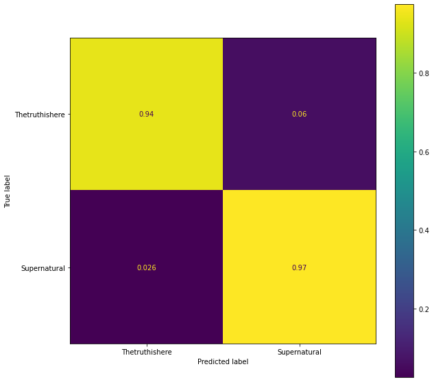
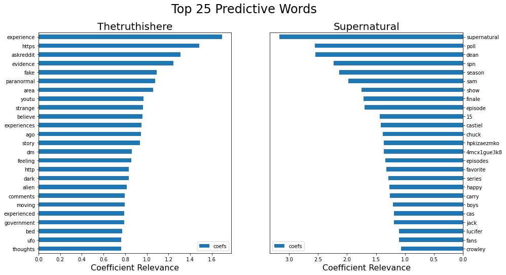
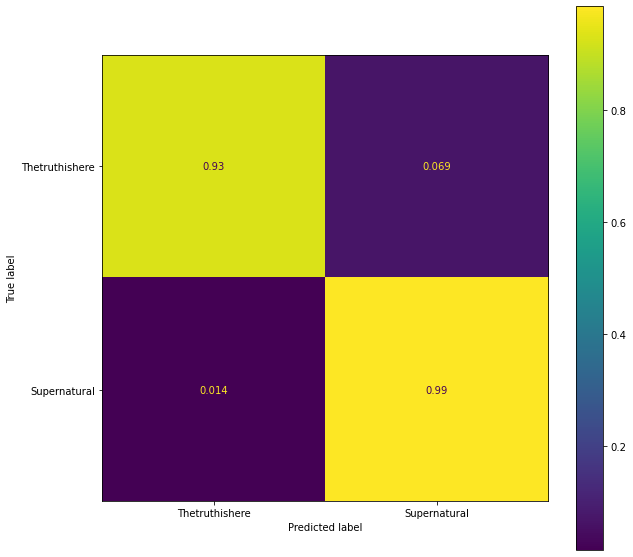
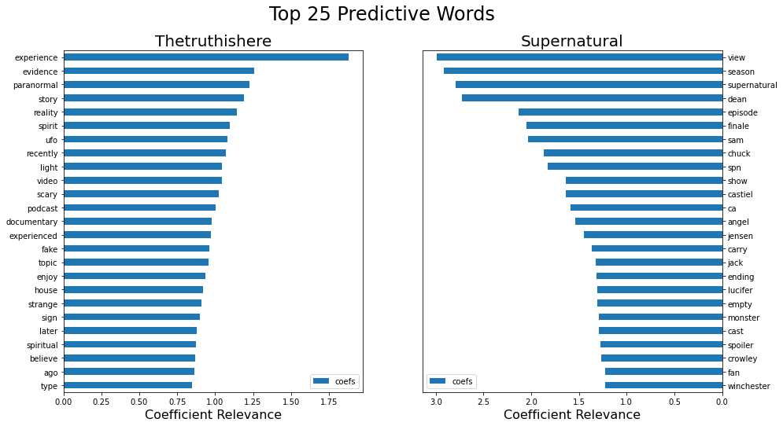

# Predicting Subreddits
## Classification of Reddit Posts using Natural Language Processing
### Presented by Rebecca Wright

<br><br>

## Overview

We wanted to create a NLP classifier to determine if a reddit post was talking about an individual's personal paranormal experience, or whether the speaker was talking about the American television series "Supernatural".

"Supernatural" ran for 15-seasons, and followed the Winchester brothers as they "crisscross the lonely and mysterious back roads of the country in their '67 Chevy Impala, hunting down every evil supernatural force they encounter along the way." [1]  Fans of the show post to the subreddit /r/Supernatural/, a subreddit community "dedicated to the TV show Supernatural on the CW Network, starring Jensen Ackles, Jared Padalecki, and Misha Collins" with 167k members. [2]

Post from this subreddit were compared against posts from the subreddit /r/Thetruthishere/, known as a "database for personal encounters with the unknown. We archive non-fiction stories dealing with spirits, paranormal, strange happenings, and unexplained sightings. Some of us believe in other-worldly beings; some of us don't. Bounce your experience here and open a discussion about what happened to you or find solace in someone's similar story. Cross-posting, discussions, and open minded skeptical analysis are always welcomed" which has 375k members. [3]


### Scope

An initial 10,000 posts were scraped from both /r/Supernatural/ and /r/Thetruthishere/ subreddits utilizing the [Pushshift](https://github.com/pushshift/api) API.  These entries where filtered down to a final dataset of 13,092 enteries between the two subreddits.

80+ features were captured by the initial webscrape in association with each post.  For the purposes of this NLP classification analysis I focused on the data fields involving the selftext (text content), and subreddit identifier. 

<br><br>

## File Directory / Table of Contents

1. Data folder
    - original_data
        * super_scrape.csv
        * truth_scrape.csv
    - cleaned_data
        * clean_data.csv
        * selftext_custom_preprocessed.csv
        * selftext_preprocessed.csv
2. Code folder
    - 01_data_collection
        * subreddit_scrape_Super.csv
        * subreddit_scrape_Truth.csv
    - 02_data_cleaning
        * combine_subreddits.ipynb
    - 03_eda
        * eda_truth.ipynb
    - 04_modeling
        * 01_refined_models.ipynb
        * 02_custom_preprocessed_base_model.ipynb
3. Presentation folder
    - Reddit_presentation.pdf
4. Images folder
    - contains image files displayed by README.md
4. Scratch folder
    - Files contained are non-deliverables and not to be used for aassignment evaluation.

<br><br>

## Data Section: 

### Data Scraping

##### **Supernatural subreddit**
* The process for scrapping posts from /r/Supernatural can be seen in the scrape_clean_notebooks folder as  [subreddit_scrape_Super notebook](code/01_data_collection/subreddit_scrape_Super.ipynb)
* The scraped posts are in the saved in the data folder as [super_scrape](data/original_data/super_scrape.csv)

##### **Thetruthishere subreddit**
* The process for scrapping posts from /r/Thetruthishere can be seen in the scrape_clean_notebooks folder as  [subreddit_scrape_Truth notebook](code/01_data_collection/subreddit_scrape_Truth.ipynb)
* The scraped posts are in the saved in the data folder as [truth_scrape](data/original_data/truth_scrape.csv)

### Data Cleaning Steps

* Reconfigured dataframe to include only the following columns
    * title
    * selftext
    * subreddit
* Removed all rows which contained any of teh following values:
    * [deleted]
    * [removed]
    * null
<br>
***
* The process for cleaning the post csvs can be seen in the scrape_clean_notebooks folder as  [combine_subreddits notebook](code/02_data_cleaning/combine_subreddits.ipynb)
* The cleaned entries were then saved in the data folder as [clean_data](data/cleaned_data/clean_data.csv)
<br>
<br>

#### **Final Dataset Summary**
* dataframe columns (3): title, selftext, subreddit
* 8,615 row entries from Thetruthishere
* 4,477 row entries from Supernatural

 <br><br>

## Methods Section: 

*Run the cell below to import all requisite methods, libraries and functions:*


```python
# LIBRARIES

import numpy as np
import matplotlib.pyplot as plt
import pandas as pd
import string
import re
import nltk

from nltk.tokenize import word_tokenize
from nltk.stem import WordNetLemmatizer

from sklearn.dummy import DummyClassifier
from sklearn.feature_extraction.text import CountVectorizer, TfidfVectorizer
from sklearn.linear_model import LogisticRegression
from sklearn.metrics import plot_confusion_matrix, classification_report
from sklearn.model_selection import train_test_split, GridSearchCV
from sklearn.pipeline import Pipeline

import warnings
warnings.filterwarnings('ignore')

# initialize stopwords
stopwords = nltk.corpus.stopwords.words('english')

#*******************************************************
# DATA IMPORT

data = pd.read_csv('data/cleaned_data/clean_data.csv')

#*******************************************************
# FUNCTIONS

# function to output results report
def print_results(grid, X_train, X_test, y_train, y_test):   
    # ***** Display Results *****  
    print('*** TEST set ***')
    print(f'Score : {grid.score(X_test, y_test)}')
    print(classification_report(y_test, grid.predict(X_test)))
    print('\n')
    print(f'Best Params : {grid.best_params_}')
    
    fig, ax = plt.subplots(figsize=(10, 10))
    plot_confusion_matrix(grid.best_estimator_, X_test, y_test, display_labels=['Thetruthishere', 'Supernatural'], normalize='true', ax=ax);

    
# functions to output top predictive words for each subreddit category
def top_words(X, vect):
    coefs = grid.best_estimator_.named_steps[list(grid.best_estimator_.named_steps.keys())[-1]].coef_
    coef_df = pd.DataFrame({'coefs':coefs[0]}, index = grid.best_estimator_.named_steps[list(grid.best_estimator_.named_steps.keys())[0]].get_feature_names())
    most_important_25 = coef_df.nlargest(25, 'coefs')
    least_important_25 = coef_df.nsmallest(25, 'coefs')
    
    fig, (ax1, ax2) = plt.subplots(ncols=2, figsize=(15, 8))
    most_important_25.plot.barh(ax = ax1)
    least_important_25.plot.barh(ax = ax2)
    ax1.invert_yaxis()
    ax2.invert_yaxis()
    ax2.yaxis.tick_right()
    ax2.set_xticklabels(np.absolute(ax2.get_xticks()))
    ax1.set_xlabel('Coefficient Relevance',fontsize = 16)
    ax2.set_xlabel('Coefficient Relevance',fontsize = 16)
    ax1.set_title('Thetruthishere', fontsize = 20)
    ax2.set_title('Supernatural', fontsize = 20)
    fig.suptitle('Top 25 Predictive Words', fontsize = 24)
```

<br><br>

---

<br><br>

### Null Predictive Model

**Analysis**: Null model, creating classification predictions based on *most frequent* classification of Thetruthishere, has an baseline-accuracy score of 65.8%.


```python
data['subreddit'].value_counts(normalize=True)
```


    Thetruthishere    0.658035
    Supernatural      0.341965
    Name: subreddit, dtype: float64


```python
# create train_test_split of data
X = data['selftext']
y = data['subreddit']
X_train, X_test, y_train, y_test = train_test_split(X, y, random_state = 123, stratify = y)
```


```python
# null model

dc = DummyClassifier(strategy = 'most_frequent') 
dc.fit(X_train, y_train)
    
print('*** TEST set ***')
print('\n')
print(f'Score : {dc.score(X_test, y_test)}')
print(classification_report(y_test, dc.predict(X_test)))
```

    *** TEST set ***
    
    
    Score : 0.6581118240146654
                    precision    recall  f1-score   support
    
      Supernatural       0.00      0.00      0.00      1119
    Thetruthishere       0.66      1.00      0.79      2154
    
          accuracy                           0.66      3273
         macro avg       0.33      0.50      0.40      3273
      weighted avg       0.43      0.66      0.52      3273
    


<br>

## Methodology

### Initial CountVectorizer / LogisticRegression Model

An intitial model that uses a CountVectorizer and LogisticRegressor with default hyperparameters performs with 96% accuracy on the test set of data.  When we look at the top 25 words whose coefficient values indicate that the presence of these words within the text 'selftext' have the greatest influence on classifying the posts subreddit category, it is clear for the need for preprocessing of the data.  Preprocessing is required in order to assure the classification model is only considering words of genuine predictive and contextual importance to the individual subreddits.  


```python
pipe = Pipeline([('countvectorizer', CountVectorizer()), ('logisticregression', LogisticRegression(max_iter=1_000))])
param = [{}]
grid = GridSearchCV(pipe, param, n_jobs = -1)
grid.fit(X_train, y_train)
print_results(grid, X_train, X_test, y_train, y_test)
```

    *** TEST set ***
    Score : 0.9621142682554231
                    precision    recall  f1-score   support
    
      Supernatural       0.95      0.94      0.94      1119
    Thetruthishere       0.97      0.97      0.97      2154
    
          accuracy                           0.96      3273
         macro avg       0.96      0.96      0.96      3273
      weighted avg       0.96      0.96      0.96      3273
    
    
    
    Best Params : {}


    

    


```python
top_words(X_test, grid.best_estimator_.named_steps[list(grid.best_estimator_.named_steps.keys())[-1]])
```


    

    


<br>

### Preprocessing

An intitial preprocessor was assembled.  The preprocessor casts text to lowercase, strips punctuation, strips stopwords using the nltk.corpus.stopwords 'english' collection, strips digits, strips words less than 3 characters in length, and applies a WordNetLemmatizer.  A generic lemmatizer was selected over the use of a nltk stemmer based on supplemental analysis on the output results of various lemmatizers and stemmers.  It was opted that word generalization was to be restricted to simplification of nouns, and so a WordNetLemmatizer was sufficient.  Also since a max_feature filter was going to be applied to the next wave of classifier models, no further preprocessing was deemed neccessary in order to ensure the removal of urls, html tags, or emojis.


```python
def preprocess(text):
    no_punc = [words for words in text if words not in string.punctuation]     # strip puncutation
    text = ''.join(no_punc)
    tokens = word_tokenize(text)
    tokens = [words for words in tokens if words not in stopwords]             # strip stop words
    tokens = [re.sub('\d', '', words) for words in tokens]                     # strip digits
    tokens = [words for words in tokens if len(words) > 2]                     # strip words less than 3 characters long
    text = [WordNetLemmatizer().lemmatize(words) for words in tokens]          # apply lemmatizer
    return ' '.join(text)
```

<br>

##### The following section applies the preprocessing step to the data, allowing all neccessary cleaning, saving, and reassignment of data.


```python
# application of the preprocessor to the dataset
X_processed = X.apply(lambda x: preprocess(x.lower()))
```


```python
# recompiling of dataframe inorder to remove selftext == EMPTY rows created by preprocessing
temp = pd.DataFrame(X_processed).join(pd.DataFrame(y))
temp['selftext'].replace('', np.nan, inplace=True)
temp.dropna(subset=['selftext'], inplace=True)

# creation of new selftext_preprocessed.csv
temp.to_csv('data/cleaned_data/selftext_preprocessed.csv', index = False)
```


```python
# import preprocessed data and reapply train test split to values
data = pd.read_csv('data/cleaned_data/selftext_preprocessed.csv')

X = data['selftext']
y = data['subreddit']
X_train, X_test, y_train, y_test = train_test_split(X, y, random_state = 123, stratify = y)
```

<br><br>

### Creating Predictive Models

The preliminary model below demonstrates the implementaion of a CountVectorizer in combination with LogisticRegression, for an accuracy performance score of 96.6%.


```python
pipe = Pipeline([('countvectorizer', CountVectorizer()), ('logisticregression', LogisticRegression(max_iter=1_000))])
param = [{}]
grid = GridSearchCV(pipe, param, n_jobs = -1)
grid.fit(X_train, y_train)
print_results(grid, X_train, X_test, y_train, y_test)
top_words(X_test, grid.best_estimator_.named_steps[list(grid.best_estimator_.named_steps.keys())[-1]])
```

    *** TEST set ***
    Score : 0.9669623738146222
                    precision    recall  f1-score   support
    
      Supernatural       0.97      0.93      0.95      1117
    Thetruthishere       0.96      0.99      0.98      2152
    
          accuracy                           0.97      3269
         macro avg       0.97      0.96      0.96      3269
      weighted avg       0.97      0.97      0.97      3269
    
    
    
    Best Params : {}


    

    


    

    


<br><br>

### Links to additional classification models
*Renderings of additional classifier models comparing the use of CountVectorizer to TfidfVectorizer and LogisticRegression to MultinomialNaiveBayes can be found in full in Section 1 of [refined_models notebook](code/04_modeling/01_refined_models.ipynb) inside of the model_notebooks folder.*
<br>
<br>
*Renderings of classifier models comparing the use of CountVectorizer to TfidfVectorizer in conjunction with various additional classifier models (Decision Tree, Bagging Tree, Random Forest, etc.) can be found in Section 2 of [refined_models notebook](code/04_modeling/01_refined_models.ipynb) inside of the model_notebooks folder.*

<br><br>

### Summarized Results

* Little difference was seen in comparative model performance between the implementation of the CountVectorizer and TfidfVectorizer with each classifier.
* In general the TfidfVectorizer did at time perform slightly better than the CountVectorizer, a margin of ~1%.
* Between the LogisticRegression model versus the MultinomialNaiveBayes model, slightly better predictive performance was seen with LogisticRegression, with an accuracy score of ~96.5%, compared to ~95% accuracy score of MultinomialNB.
* There were 3 classifiers that performed at around ~95% accuracy, and those were LogisticRegression, MultinomialNB, and BaggingClassifier.

Base models proved much more efficient than initially anticipated, considering the similarities in the content of personal paranoormal experience narratives to the subject-matter of Supernatural.

This can be attributed to the unanticipated prevelance of "industry-jargon" used within the Supernatural subreddit.  Words seen with repeated frequency in top 25 predictive words for Supernatural include:
    <li> season / series / episode / spoiler / actor (television industry terms)
    <li> dean / sam / winchester (proper nouns of characters)

### A sample base model using the custom stopword preprocessor can be found in [custom_preprocessed base model notebook](code/04_modeling/02_custom_preprocessed_base_model.ipynb)
- This model still predicts with 90% accuracy, despite the increase in stopwords to be removed prior to modeling.

<br><br>

## Final thoughts: 

Even though the television show Supernatural and the non-fiction encounters as outlined in r/Thetruthishere both cover supernatural content and events, unanticipated expressions can exert surprising predictive influence on the classifier models.

Further study should be devoted to expanding the list of words to be stripped from a post to include proper nouns of the television show as well as television industry jargon to further evaluate the predictive capabilities of these classifier models.

<br><br>

## Supplemental Observations:
### The posting habits of different subreddit communities

An initial 10,000 posts were scraped from both subreddits.

r/Supernatural stats:
* Posts were made between 1/14/21 and 7/13/20.
* After cleaning to remove deleted posts or posts from discontinued users, 46% of posts remained.

r/Thetruthishere stats:
* Posts were made between 1/14/21 and 9/25/16.
* After cleaning, 88% of posts remained.

Members of r/Thetruthishere may post less overall, but the rate at which their posts and/or accounts are removed from service is much lower. This may speak to the commitment of users posting about personal experiences, rather than fan-based content.

---

<br><br><br>

**Links**

[1]    https://www.rottentomatoes.com/tv/supernatural<br>
[2]    https://www.reddit.com/r/Supernatural/<br>
[3]    https://www.reddit.com/r/Thetruthishere/<br>
